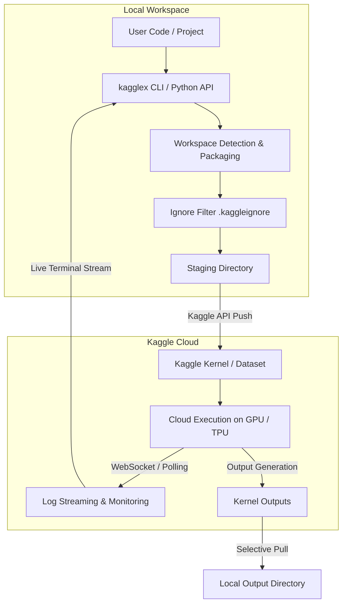

# kagglex Documentation

`kagglex` is a Python CLI and developer library designed to execute local Python scripts, modules, and machine learning experiments transparently on Kaggle's cloud GPU and TPU environments.

## Why kagglex

Running machine learning models locally often runs into hardware bottlenecks (lack of VRAM, missing accelerators, or thermal throttling). While Kaggle provides 30 hours of dual Nvidia T4/P100 GPUs and 20 hours of TPU v3-8 compute weekly, using it traditionally requires:

- Manually copying code into web notebooks
- Uploading zip archives through the Kaggle UI
- Re-downloading checkpoint artifacts by hand
- Dealing with slow manual feedback loops

`kagglex` automates the entire lifecycle directly from your local terminal or IDE: packaging your source code, dispatching cloud execution, streaming remote stdout logs in real-time, monitoring execution status, and pulling back output files.

## Key Features

- **Zero-Friction Remote Dispatch**: Execute standalone `.py` scripts or full project modules with a single command.
- **Accelerator Selection**: Seamlessly target dual Nvidia T4 (`t4-2x`), Nvidia P100 (`p100`), or TPU v3-8 (`v3-8`).
- **Interactive Jupyter REPL**: Attach directly to running Kaggle notebook sessions for sub-second REPL execution, GPU profiling, and file synchronization.
- **Automatic Large Payload Handling**: Automatically offload workspaces and datasets exceeding Kaggle's 5 MB code limit into private, versioned Kaggle datasets.
- **Accelerator Quota Tracking**: Monitor your estimated rolling 7-day GPU and TPU consumption locally against Kaggle's weekly allowances.
- **Multi-Tier Declarative Configuration**: Configure defaults in user-level `~/.kagglex/config.toml`, repository `pyproject.toml`, or `kagglex.toml`.
- **Smart Artifact Filtering**: Include or exclude output files and checkpoints using glob patterns.

## Architecture Overview

## Documentation Structure

- [Quickstart](quickstart.md): Get up and running in under 2 minutes.
- [User Guide](user-guide/running-experiments.md): In-depth tutorials on dispatching jobs, interactive REPL sessions, managing datasets, tracking quotas, and configuration.
- [CLI Reference](cli-reference.md): Detailed parameter and flag references for all subcommands.
- [Python API](python-api.md): Programmatic automation using the `KaggleRunner` and `InteractiveClient` classes.
- [Troubleshooting](troubleshooting.md): Solutions for common setup and execution issues.
